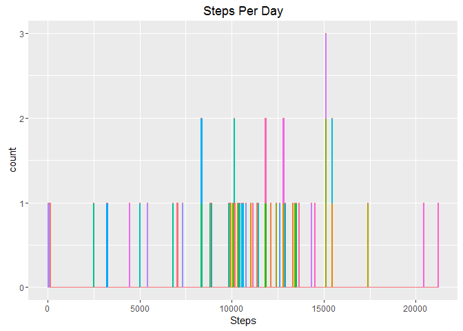
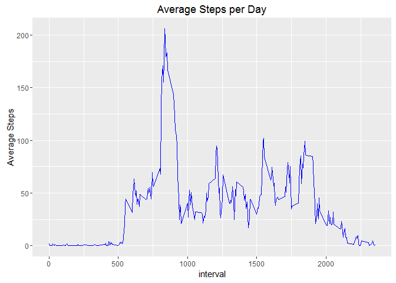
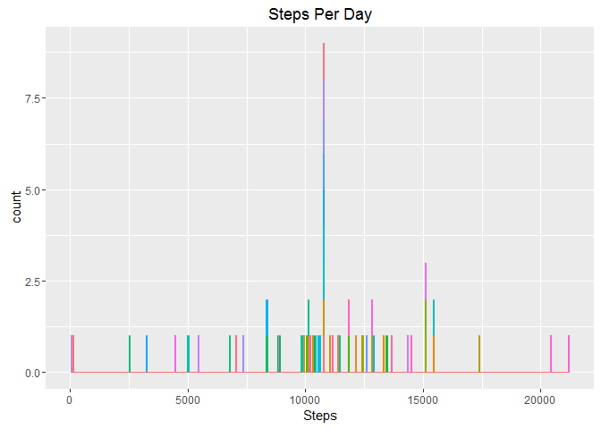
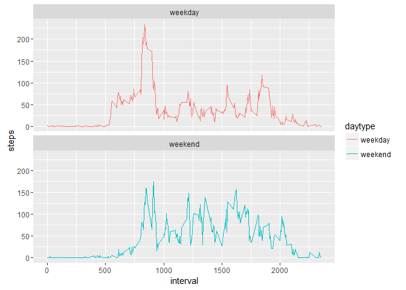

# Reproducible Research: Peer Assessment 1

## About
This analysis complies with Coursera's Reproducible Research course's first programming assignment.  Data was collected
from a personal activity monitor during October and November, 2012 and can be found [here.](https://d396qusza40orc.cloudfront.net/repdata%2Fdata%2Factivity.zip)

## Data
The variables included in this dataset are:

* steps: Number of steps taking in a 5-minute interval (missing values are coded as NA)
* date: The date on which the measurement was taken in YYYY-MM-DD format
* interval: Identifier for the 5-minute interval in which measurement was taken

The dataset is stored in a comma-separated-value (CSV) file and there are a total of 17,568 observations in this dataset.

### Analysis

## Loading and preprocessing the data


```r
# Unzip and read file
if(!file.exists("activity.csv")) {
        unzip("repdata_data_activity.zip")
        move <<- read.csv("activity.csv", stringsAsFactors = FALSE)
     } else {
        move <<- read.csv("activity.csv", stringsAsFactors = FALSE)
     }
```


```r
# Load ggplot2 for the graphs, dplyr for the summary stats, lubridate for the dates
require(ggplot2)
require(dplyr)
require(lubridate)
```

## What is mean total number of steps taken per day?

First we convert the date field to a defined date with lubridate.  Then we organize the dataset and calculate the means.

```r
move$date <- ymd(move$date)
steps <- move %>%
                filter(!is.na(steps)) %>%
                group_by(date) %>%
                summarize(steps = sum(steps)) %>%
                print
```

```
## Source: local data frame [53 x 2]
## 
##          date steps
##        <date> <int>
## 1  2012-10-02   126
## 2  2012-10-03 11352
## 3  2012-10-04 12116
## 4  2012-10-05 13294
## 5  2012-10-06 15420
## 6  2012-10-07 11015
## 7  2012-10-09 12811
## 8  2012-10-10  9900
## 9  2012-10-11 10304
## 10 2012-10-12 17382
## ..        ...   ...
```

The graph is colored by date but offers little information.  Maybe, if this were an individual training for an athletic event, we would see a pattern of increasing steps per day.  However, there is no discernable pattern here.


```r
ggplot(steps, aes(steps)) +
        geom_histogram(data = steps, aes(color = as.factor(date), fill = as.factor(date)), bins = 500) +
        theme(legend.position="none") +
        labs(title = "Steps Per Day", x = "Steps")
```

<!-- -->


```r
stepsum <- steps %>%
                filter(!is.na(steps)) %>%
                summarize(mean = mean(steps),
                          med =  median(steps)) %>%
                print
```

```
## Source: local data frame [1 x 2]
## 
##       mean   med
##      <dbl> <int>
## 1 10766.19 10765
```

The mean is 10766.  The median is 10765.

## What is the average daily activity pattern?


```r
# average per interval
minsum <- move %>%
                filter(!is.na(steps)) %>%
                group_by(interval) %>%
                summarize(mean = mean(steps)) %>%
                print
```

```
## Source: local data frame [288 x 2]
## 
##    interval      mean
##       <int>     <dbl>
## 1         0 1.7169811
## 2         5 0.3396226
## 3        10 0.1320755
## 4        15 0.1509434
## 5        20 0.0754717
## 6        25 2.0943396
## 7        30 0.5283019
## 8        35 0.8679245
## 9        40 0.0000000
## 10       45 1.4716981
## ..      ...       ...
```

```r
# plot of mean steps per interval
ggplot(minsum, aes(x = interval, y = mean)) +
        geom_line(color = "blue") +
        labs(title = "Average Steps per Day", y = "Average Steps")
```

<!-- -->

```r
# int 835 has largest mean
minsum$interval[which.max(minsum$mean)]
```

```
## [1] 835
```

Interval 835 has the highest average number of steps at 206.1698113

## Imputing missing values

Data set contains 2304 missing values.  In order to calculate the effect of the missing data on the summary stats, we'll impute these data points with the missing 5 minutes interval's average across the data set.

Create a new dataset with imputed values.


```r
moveNA <- move
nas <- is.na(moveNA$steps)
avg <- tapply(moveNA$steps, moveNA$interval, mean, na.rm=TRUE, simplify=TRUE)
moveNA$steps[nas] <- avg[as.character(moveNA$interval[nas])]
```

Draw new histogram and calculate new mean and median values utilizing complete data set.


```r
# Graph of NA free data set
stepsNA <- moveNA %>%
        filter(!is.na(steps)) %>%
        group_by(date) %>%
        summarize(steps = sum(steps)) %>%
        print
```

```
## Source: local data frame [61 x 2]
## 
##          date    steps
##        <date>    <dbl>
## 1  2012-10-01 10766.19
## 2  2012-10-02   126.00
## 3  2012-10-03 11352.00
## 4  2012-10-04 12116.00
## 5  2012-10-05 13294.00
## 6  2012-10-06 15420.00
## 7  2012-10-07 11015.00
## 8  2012-10-08 10766.19
## 9  2012-10-09 12811.00
## 10 2012-10-10  9900.00
## ..        ...      ...
```

```r
ggplot(stepsNA, aes(steps)) +
        geom_histogram(data = stepsNA, aes(color = as.factor(date), fill = as.factor(date)), bins = 500) +
        theme(legend.position="none") +
        labs(title = "Steps Per Day", x = "Steps")
```

<!-- -->

```r
# Mean Median calculation with NAs imputed
stepsumNA <- steps %>%
             filter(!is.na(steps)) %>%
             summarize(mean = mean(steps),
                       med =  median(steps)) %>%
             print
```

```
## Source: local data frame [1 x 2]
## 
##       mean   med
##      <dbl> <int>
## 1 10766.19 10765
```

There is little difference between the two data sets.  This makes sense when taking into account how the data was imputed.  Missing values were filled in with the corresponding means, which essentially just reinforces the mean.

## Are there differences in activity patterns between weekdays and weekends?

Using lubridate, discern weekend vs weekday in dataset.

```r
# Weekday, Weekend (weekdays from lubridate)
# If day of week is Sat or Sun then weekend
# if(else) day of week anything else then weekday
daydata <- mutate(move, daytype = ifelse(weekdays(move$date) == "Saturday" |
                                         weekdays(move$date) == "Sunday",
                                         "weekend",
                                         "weekday"))
daydata$daytype <- as.factor(daydata$daytype)

daysum <- daydata %>%
          group_by(interval, daytype) %>%
          summarize(steps = mean(steps, na.rm = TRUE)) %>%
          print
```

```
## Source: local data frame [576 x 3]
## Groups: interval [?]
## 
##    interval daytype     steps
##       <int>  <fctr>     <dbl>
## 1         0 weekday 2.3333333
## 2         0 weekend 0.0000000
## 3         5 weekday 0.4615385
## 4         5 weekend 0.0000000
## 5        10 weekday 0.1794872
## 6        10 weekend 0.0000000
## 7        15 weekday 0.2051282
## 8        15 weekend 0.0000000
## 9        20 weekday 0.1025641
## 10       20 weekend 0.0000000
## ..      ...     ...       ...
```

Faceted graph to show differences between weekday and weekend steps


```r
ggplot(daysum, aes(x=interval, y=steps, color = daytype)) +
        geom_line() +
        facet_wrap(~daytype, ncol = 1, nrow=2)
```

<!-- -->

Weekday activity begins earlier, while weekday activity is greater overall.

